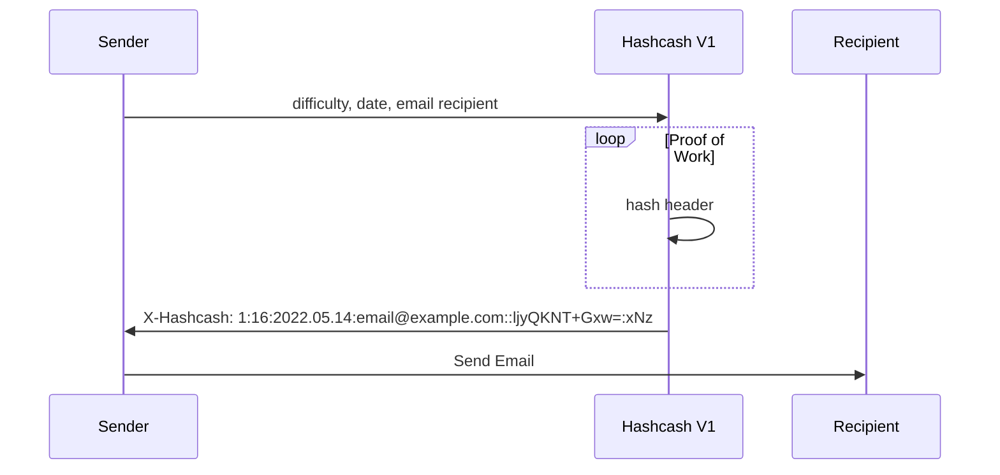
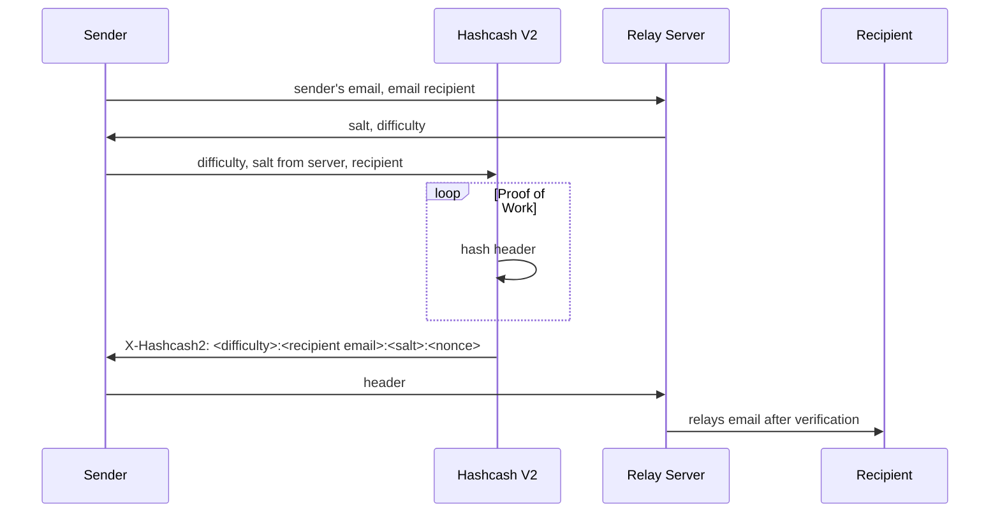

# hashcæ

### version1

- no scaling of difficulty with amount of spam emails
- no way for email rcpt to require higher difficulty
- hashes can be computed ahead of time and then spammed later

`X-Hashcash: <version = 1>:<difficulty = 20>:<date>:<email>::<random>:<nonce>`

### version2

`X-Hashcash2: <salt>:<difficulty>:<recipient email>:<nonce>`

